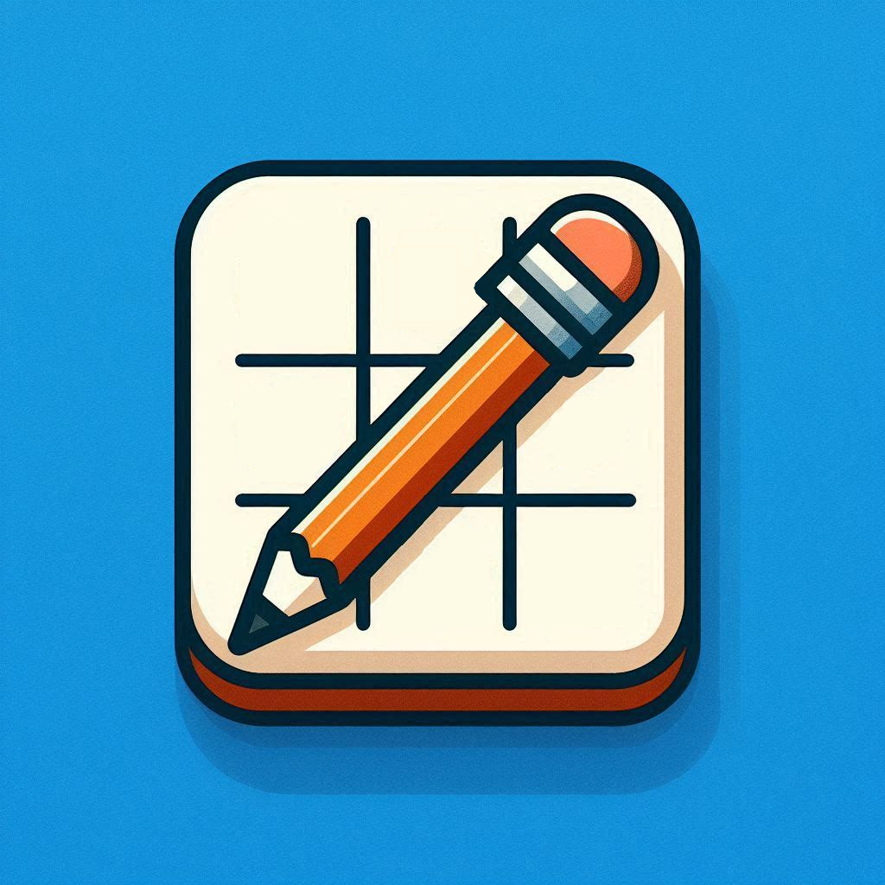
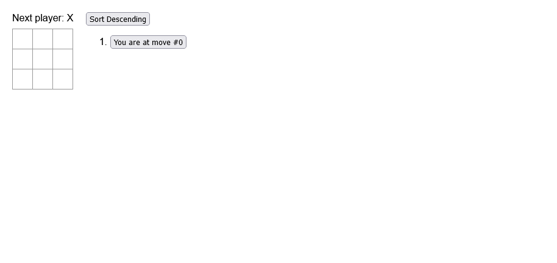
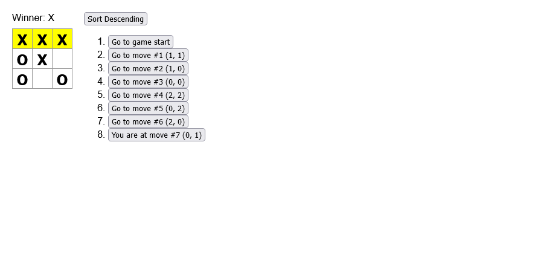

	
	<h1>Tic-Tac-Toe</h1>

Welcome to the **Tic-Tac-Toe** App!

This is a Tic-Tac-Toe game built using React and designed to demonstrate some key React concepts such as component-based architecture, state management, and event handling.

It allows users to play a game of tic-tac-toe!

## Features

- **Player turns**: X and O alternate turns.
- **Move History**: Players can navigate through the game’s history to view previous states of the board.
- **Move Location**: Each move in the history is displayed with its corresponding (row, col) location on the board.
- **Winning Line Highlight**: The three squares that form a winning combination are highlighted.
- **Sort Moves**: The move history can be sorted in ascending or descending order.

## Technologies

- React
- HTML
- CSS
- JavaScript

## Getting Started

### Prerequisites

- Node.js
- NPM

### Installation

1. Clone the repository:
	- `git clone https://github.com/chrisjamiecarter/tic-tac-toe.git`

2. Navigate to the project directory:
	- `cd tic-tac-toe`

3. Install dependencies:
	- `npm install`

### Running the Application

1. Start the development server in the project directory:
	- `npm start`

## Usage

Once the application is running:

- Click on any square to make a move (X starts first).
- The game status will update with whose turn it is (X or O).
- Click on any entry in the move history to jump back to that state.
- Toggle between ascending and descending order for the move list using the **Sort Moves** button.
- When someone wins, the winning combination is highlighted.

### New Game

### End Game

## How It Works

This project is broken down into three key React components: `Square`, `Board`, and `Game`.

1. `Square` **Component**: Represents an individual square in the Tic-Tac-Toe grid. It renders a button, and when clicked, it calls an `onSquareClick` function passed down from the `Board`.
2. `Board` **Component**: This component is responsible for displaying the 3x3 grid of squares. It uses loops to generate the squares and renders the `Square` component for each position on the board. It also determines if a player has won and passes down click events and the state of each square.
	- **Game State**: The board state (which stores X, O, or `null` for each square) is maintained by the parent `Game` component. The board is re-rendered whenever the state is updated.
    - **Winner Calculation**: The `Board` checks for a winning combination of squares. If a player wins, the winning line is highlighted. If there are no other squares left to be played, the game is declared a draw.
3. `Game` **Component**: The top-level component that maintains the entire game's state. As well as:
	- **History of Moves**: Every time a player makes a move, the current state of the board is stored in a history array. This allows the game to show a list of past moves, and players can go back to any previous state.
	- **Move Location**: Each move is associated with the row and column of the square that was clicked. This is displayed in the move history.
	- **Move Sorting**: Players can toggle the sorting order of the move history between ascending and descending.

## Contributing

Contributions are welcome! Please fork the repository and create a pull request with your changes. For major changes, please open an issue first to discuss what you would like to change.

## License

This project is licensed under the MIT License. See the [LICENSE](./LICENSE) file for details.

## Contact

For any questions or feedback, please open an issue.

---
***Happy Tic-Tac-Toeing!***
